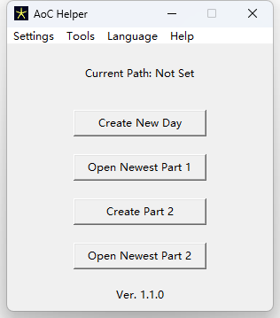

# AoC Helper

This tool can help you manage your [Advent of Code (AoC)](https://adventofcode.com) files quickly and easily.

## Current Version

- Version: 1.2.0
- Release Date: 2024-12-28

## About

- Language: Python
- Platform: Windows
- Author: [Withered Flower](https://github.com/Withered-Flower-0422)
- Email: 2734850178@qq.com

## Installation

You can download the latest release from the [releases page](https://github.com/Withered-Flower-0422/AoC_Helper/releases) and install it.

## Usage

||
|:--:|

1. Set the path to your AoC directory by clicking on the `Settings/Set Path` button, or you can drag and drop the directory directly onto the window, or you can create a new directory by clicking on the `Tools/Create New Aoc` button. Note that the folder name must be in the format `aocYYYY`, e.g. `aoc2024` for AoC challenges of year 2024.

2. Set cookies by clicking on the `Settings/Set Cookies` button. Your cookies can be checked by going to the AoC website and copying the cookies from your browser.

3. `Create New Day` button will create a new directory for the next day, and automatically create following files: `puzzle.txt`, `example.txt`, `part1.js`. `puzzle.txt` will be written with the puzzle input automatically. Then the `example.txt` will open automatically, where you can write the example input. *Note: The solution file will always be a JavaScript file. If you want to use a different language, you can change the extension of the file, or modify the source code and build it on your own.*

4. `Open Newest Part 1` button will open the latest `part1.js` file.

5. `Create Part 2` button will copy the `part1.js` file to a new file named `part2.js`.

6. `Open Newest Part 2` button will open the latest `part2.js` file.